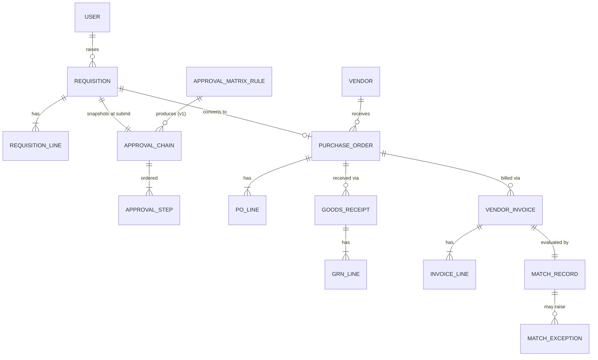
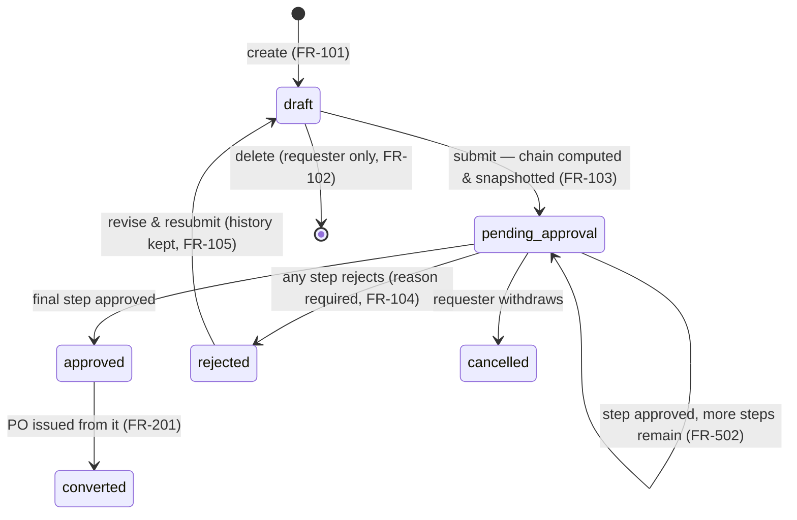
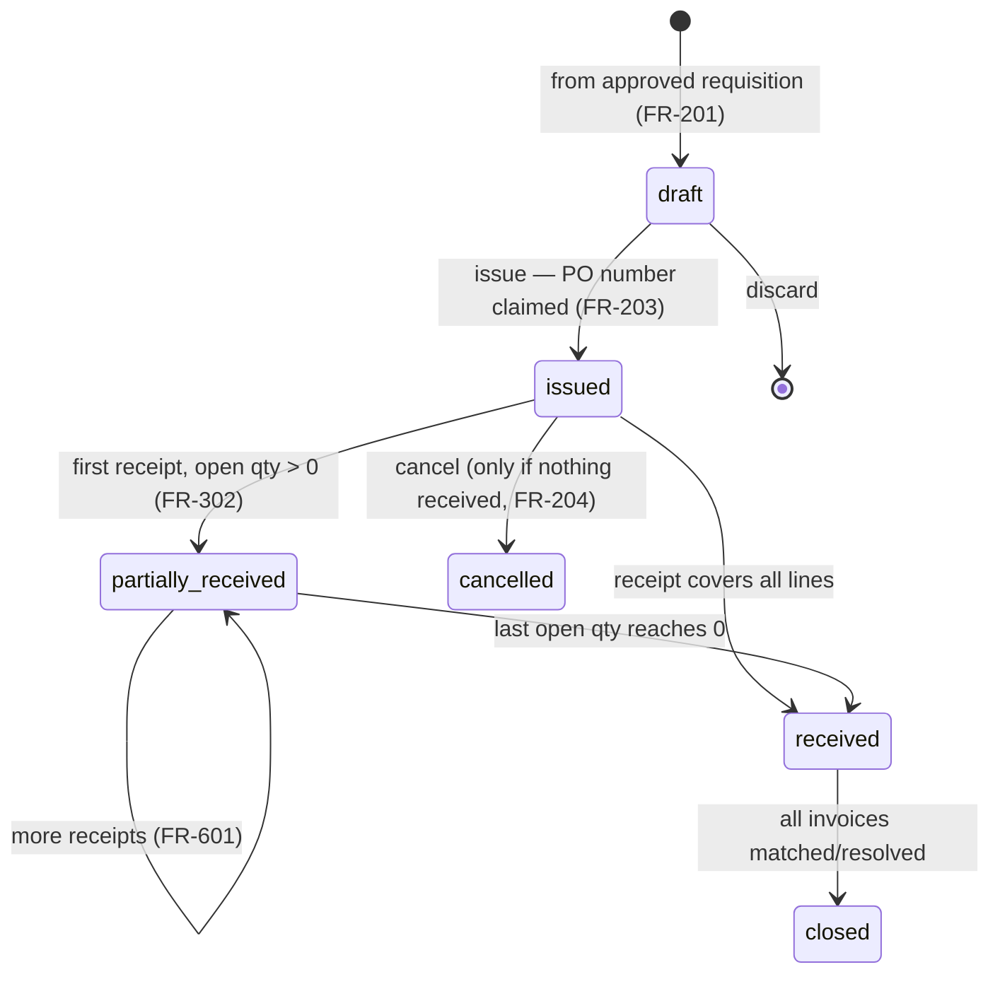
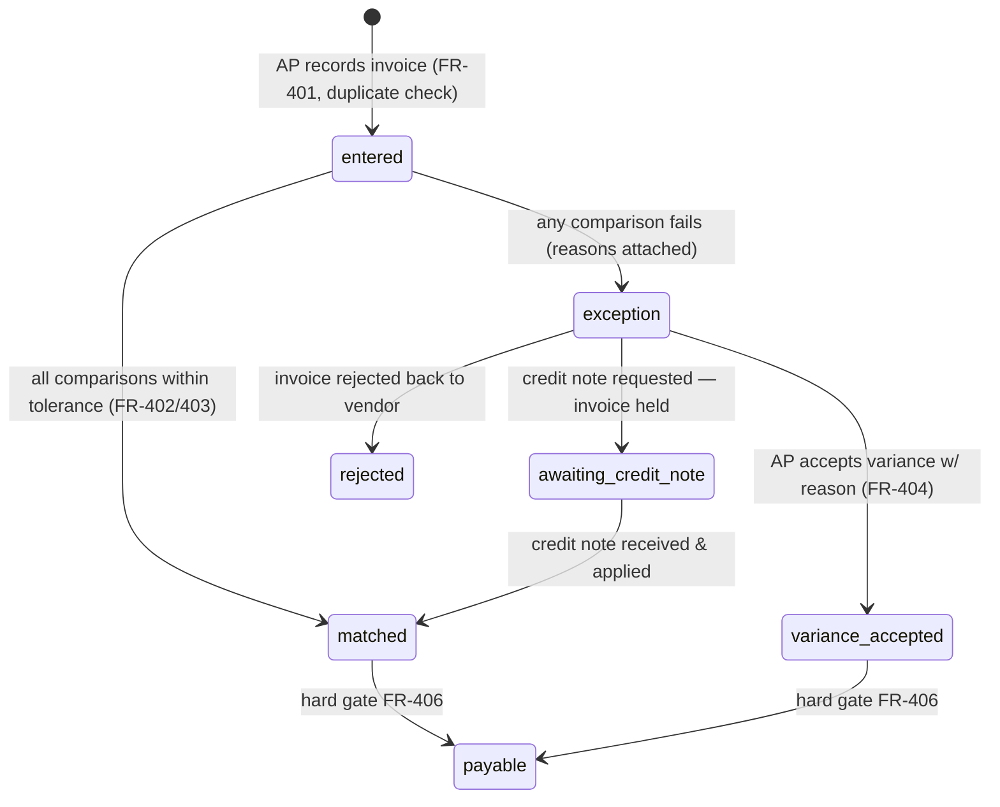
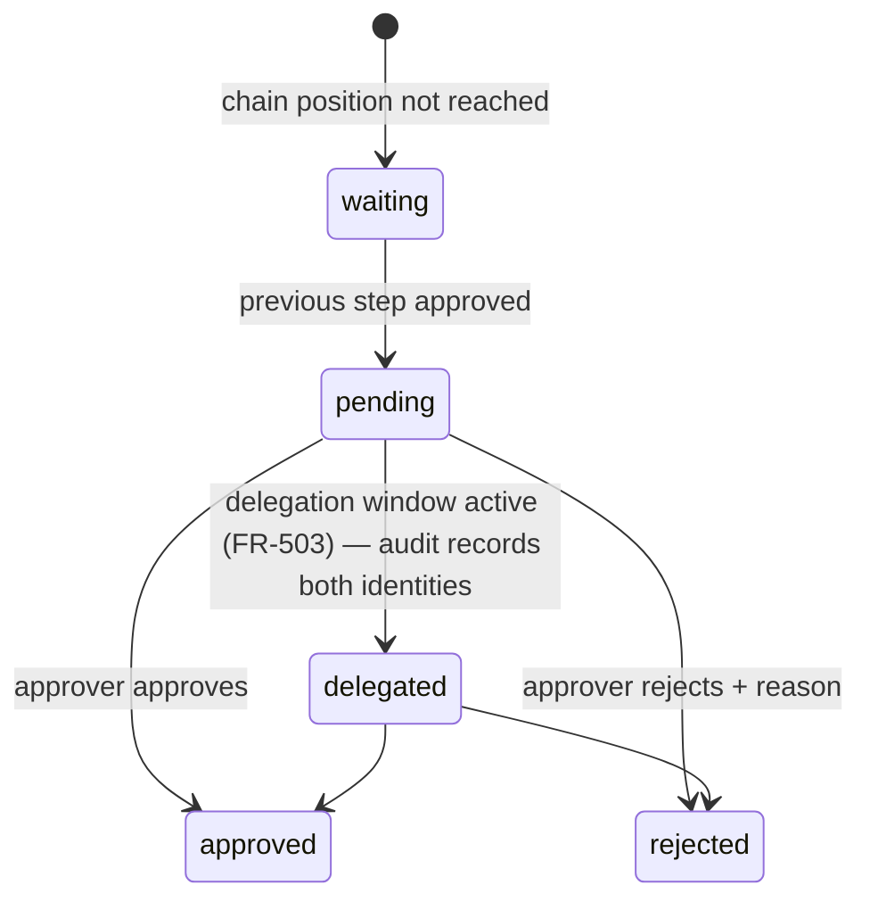

# Domain Model — TriMatch

- **Status:** accepted
- **Date:** 2026-07-02
- **Related:** [01-prd.md](01-prd.md) · [04-architecture.md](04-architecture.md)

## 1. Glossary

| Term                     | Meaning                                                         |
| ------------------------ | --------------------------------------------------------------- |
| **Requisition (REQ)**    | An employee's request to buy something; not yet a commitment    |
| **Approval chain**       | Ordered approver steps computed from the matrix at submission   |
| **Purchase order (PO)**  | The company's binding order to one vendor                       |
| **Goods receipt (GRN)**  | Warehouse record of what physically arrived against a PO        |
| **Vendor invoice (INV)** | The vendor's bill against a PO                                  |
| **3-way match**          | Comparison PO ↔ GRN ↔ INV within tolerances; gate to payment    |
| **Exception**            | A failed match routed to AP for resolution                      |
| **Open quantity**        | PO line qty ordered − qty received (drives receiving)           |
| **Payable**              | Invoice cleared for payment (matched or variance accepted)      |
| **Tolerance**            | Allowed variance (basis points or absolute) per match dimension |

## 2. Entities & relationships

Key modeling decisions:

- **Lines, not headers, carry the business.** Matching, receiving, and open-quantity
  tracking all happen per line; headers aggregate.
- **The approval chain is a snapshot** (FR-504): computed once at submission from matrix
  rules, then owned by the requisition. Matrix edits never touch in-flight chains.
- **Match records are immutable evidence** (FR-405): they embed the tolerance values used
  and every per-line comparison. Resolutions append; nothing is edited.
- **Money:** `amount_minor BIGINT` + `currency CHAR(3)` everywhere; FX rate for matrix
  routing stored on the requisition at submission (PRD §5.3).
- **Audit:** `audit_log(actor, entity_type, entity_id, action, before, after, at)` —
  append-only, written in the same transaction as the change (NFR-01).

## 3. Lifecycles (state machines)

Transitions not drawn are **invalid** and rejected with `INVALID_TRANSITION` (NFR-03).
Every transition writes an audit row.

### 3.1 Requisition

### 3.2 Purchase order

### 3.3 Vendor invoice & match (v1)

### 3.4 Approval step (one step of a chain)

## 4. Invariants (enforced in code AND asserted in tests)

1. **I-1** An issued PO's lines never change (MVP; v1 amendments create version N+1 — FR-604).
2. **I-2** Σ received qty per line ≤ ordered qty (FR-303; v1: ≤ ordered × (1 + over-receipt tolerance)).
3. **I-3** Σ invoiced qty per line ≤ Σ received qty per line — cumulative, across partial invoices (case F/G, PRD §5.2).
4. **I-4** No invoice reaches `payable` without a `matched` or `variance_accepted` match record (FR-406).
5. **I-5** Approval chains are immutable after submission; only step states change (FR-504).
6. **I-6** Document numbers are gapless per year per type (PRD §5.4) — claimed inside the issuing transaction.
7. **I-7** Audit rows are never updated or deleted.
8. **I-8** All money arithmetic happens in integer minor units; comparisons in basis points (PRD §5.2).
   ([ADR-0004](adr/0004-money-representation.md) decides to migrate this to DECIMAL;
   in effect once the Epic 20 money-representation task lands.)
9. **I-9** Master data & actors (`users`, `vendors`) are soft-deleted, never hard-deleted, and
   no FK cascades across an entity boundary — so history always resolves the real actor
   ([ADR-0007](adr/0007-deletion-strategy.md); see §4.1).

### 4.1 Deletion & retention tiers (ADR-0007)

Three tiers, enforced in code and by the schema:

- **Tier 1 — master data & actors are soft-deleted.** `users.active` and `vendors.active`
  mark deactivation; the row is never physically removed. A deactivated user cannot
  authenticate (login returns `ACCOUNT_DEACTIVATED` _after_ the password check, so account
  state never leaks) and is excluded from approver pools (named titles filter `active:true`;
  hierarchy titles fail loudly with `NO_APPROVER` if the manager is deactivated).
  Deactivation is reversible (`PATCH /users/:id { active }`, audited as
  `user.deactivated`/`user.reactivated`; an admin cannot deactivate themselves)
  and bumps `token_version`, so any live JWT is revoked at once (869dzymvv, below).
- **Tier 2 — actor/audit FKs never cascade.** Every FK into `users` (except the optional
  `manager_id`, which is `SET NULL`) is `NO ACTION`, so a hard `DELETE` of a referenced user
  _errors_ rather than erasing history. Append-only tables (`audit_log`, `match_records`,
  `po_amendments`) are never a cascade target — this is the enforcement mechanism for I-7.
  (`NO ACTION` already provides RESTRICT semantics; because users are soft-deleted the delete
  path is unreachable in normal operation, so the constraints are left as-is rather than
  rewritten to explicit `RESTRICT` — a documented no-op.)
- **Tier 3 — `CASCADE` only within an aggregate.** A parent and the child rows it exclusively
  owns (a requisition and its lines, an invoice/PO/GRN and its lines, a requisition and its
  approval steps). `notifications.recipient_id → users` is the sole cross-entity `CASCADE`,
  kept deliberately: notifications are personal, derived, ephemeral data (supports
  right-to-erasure), and the cascade is dormant while users are soft-deleted.

### 4.2 Session invalidation (token versioning · 869dzymvv)

JWTs are stateless, so a change of credentials or status must be able to revoke tokens that
were already handed out. `users.token_version` is a monotonic counter stamped into every JWT
as the `tv` claim at login; `JwtAuthGuard` reads the live `token_version` on **every**
authenticated request and rejects a token whose `tv` is behind it (`TOKEN_REVOKED`) or whose
account is inactive (`ACCOUNT_DEACTIVATED`). The counter is bumped on **password change**
(`change-password` — signs out all sessions including the current one), **password reset**
(kills any lingering/stolen session), and **deactivation**. The per-request lookup is a
narrow two-column read; caching it in Redis is a noted future optimisation.

## 5. Domain events (for notifications & future integrations)

`requisition.submitted` · `requisition.approved` · `requisition.rejected` ·
`po.issued` · `po.received` · `po.reapproval_required` · `grn.recorded` ·
`invoice.entered` · `invoice.matched` · `invoice.exception` · `invoice.payable` ·
`delegation.created`

MVP consumes these in-process (notifications); the names are the contract a future
message broker would inherit. Each event name is also a `notifications.type`
value: the BullMQ worker persists a per-user row (`notifications` table) that the
notification center API (`GET/PATCH /api/v1/notifications`) exposes, scoped to the
recipient.
