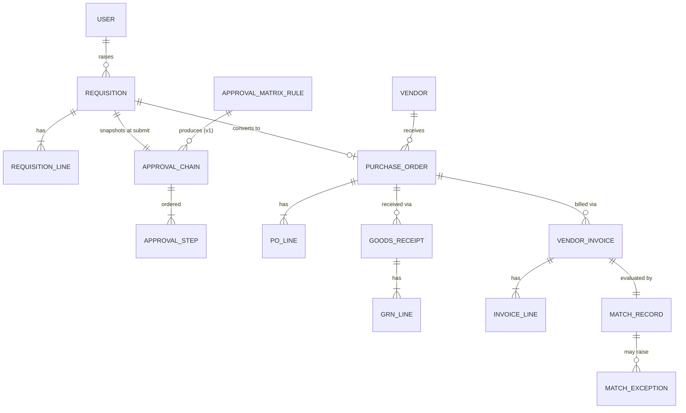
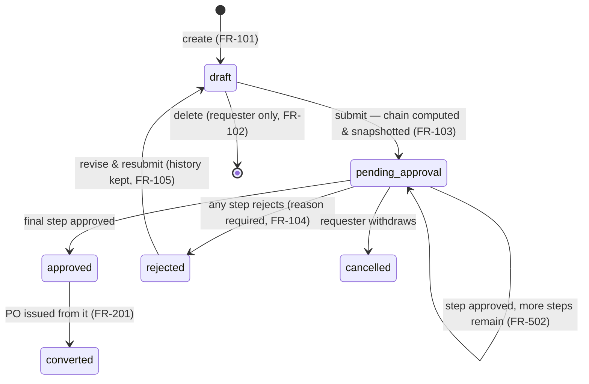
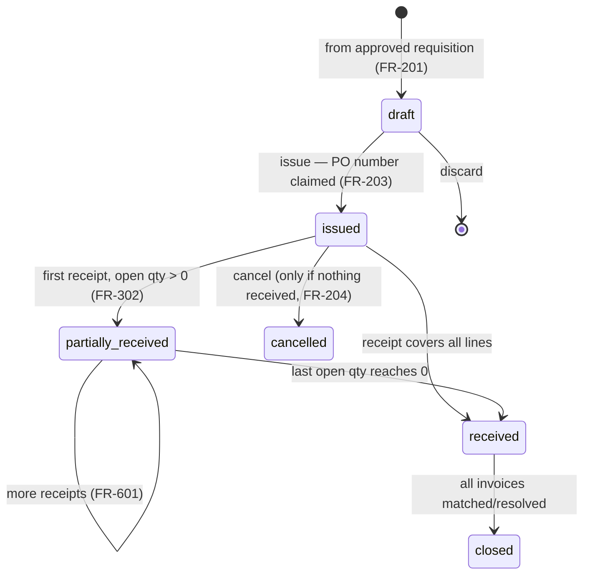
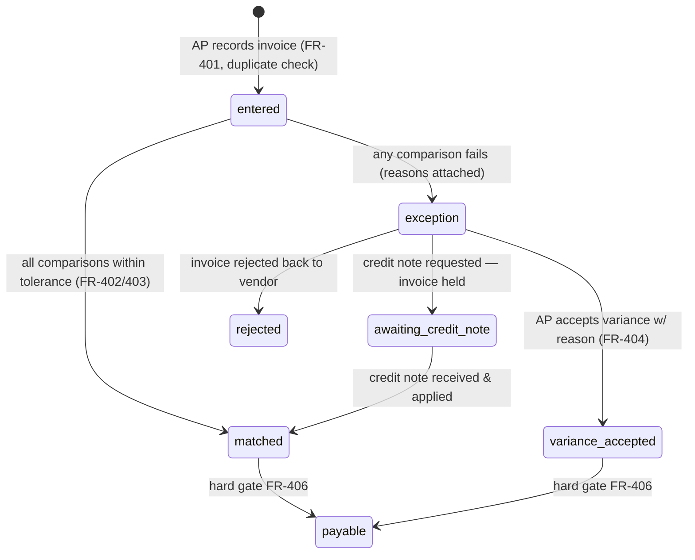
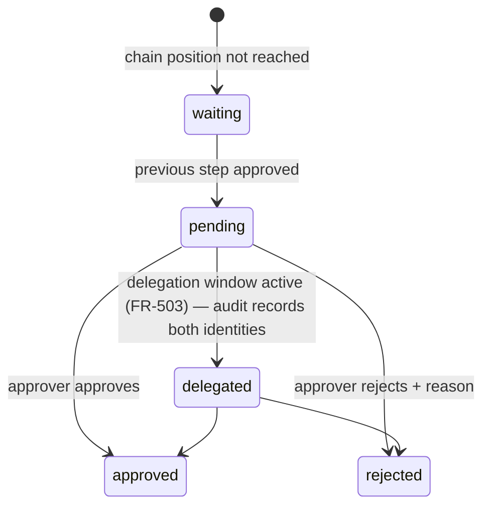

# Domain Model — TriMatch

- **Status:** accepted
- **Date:** 2026-07-02
- **Related:** [01-prd.md](01-prd.md) · [04-architecture.md](04-architecture.md)

## 1. Glossary

| Term | Meaning |
| --- | --- |
| **Requisition (REQ)** | An employee's request to buy something; not yet a commitment |
| **Approval chain** | Ordered approver steps computed from the matrix at submission |
| **Purchase order (PO)** | The company's binding order to one vendor |
| **Goods receipt (GRN)** | Warehouse record of what physically arrived against a PO |
| **Vendor invoice (INV)** | The vendor's bill against a PO |
| **3-way match** | Comparison PO ↔ GRN ↔ INV within tolerances; gate to payment |
| **Exception** | A failed match routed to AP for resolution |
| **Open quantity** | PO line qty ordered − qty received (drives receiving) |
| **Payable** | Invoice cleared for payment (matched or variance accepted) |
| **Tolerance** | Allowed variance (basis points or absolute) per match dimension |

## 2. Entities & relationships

Key modeling decisions:

- **Lines, not headers, carry the business.** Matching, receiving, and open-quantity
  tracking all happen per line; headers aggregate.
- **The approval chain is a snapshot** (FR-504): computed once at submission from matrix
  rules, then owned by the requisition. Matrix edits never touch in-flight chains.
- **Match records are immutable evidence** (FR-405): they embed the tolerance values used
  and every per-line comparison. Resolutions append; nothing is edited.
- **Money:** `amount_minor BIGINT` + `currency CHAR(3)` everywhere; FX rate for matrix
  routing stored on the requisition at submission (PRD §5.3).
- **Audit:** `audit_log(actor, entity_type, entity_id, action, before, after, at)` —
  append-only, written in the same transaction as the change (NFR-01).

## 3. Lifecycles (state machines)

Transitions not drawn are **invalid** and rejected with `INVALID_TRANSITION` (NFR-03).
Every transition writes an audit row.

### 3.1 Requisition

### 3.2 Purchase order

### 3.3 Vendor invoice & match (v1)

### 3.4 Approval step (one step of a chain)

## 4. Invariants (enforced in code AND asserted in tests)

1. **I-1** An issued PO's lines never change (MVP; v1 amendments create version N+1 — FR-604).
2. **I-2** Σ received qty per line ≤ ordered qty (FR-303; v1: ≤ ordered × (1 + over-receipt tolerance)).
3. **I-3** Σ invoiced qty per line ≤ Σ received qty per line — cumulative, across partial invoices (case F/G, PRD §5.2).
4. **I-4** No invoice reaches `payable` without a `matched` or `variance_accepted` match record (FR-406).
5. **I-5** Approval chains are immutable after submission; only step states change (FR-504).
6. **I-6** Document numbers are gapless per year per type (PRD §5.4) — claimed inside the issuing transaction.
7. **I-7** Audit rows are never updated or deleted.
8. **I-8** All money arithmetic happens in integer minor units; comparisons in basis points (PRD §5.2).

## 5. Domain events (for notifications & future integrations)

`requisition.submitted` · `requisition.approved` · `requisition.rejected` ·
`po.issued` · `po.received` · `grn.recorded` · `invoice.entered` ·
`invoice.matched` · `invoice.exception` · `invoice.payable`

MVP consumes these in-process (notifications); the names are the contract a future
message broker would inherit.
