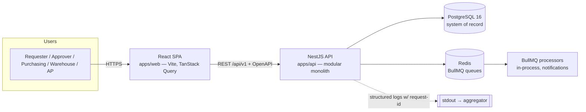

# Architecture — TriMatch

- **Status:** accepted
- **Date:** 2026-07-02
- **Related:** [ADR-0001](adr/0001-tech-stack.md) · [03-domain.md](03-domain.md)

## 1. Container view (C4 level 2)



A **modular monolith** on purpose: one deployable, strict module boundaries. Modules
communicate through services and in-process domain events ([03-domain.md](03-domain.md) §5) —
the seams where a future split would happen, without paying distributed-systems cost now.

## 2. NestJS module map

| Module          | Owns                                                           | Key rules                        |
| --------------- | -------------------------------------------------------------- | -------------------------------- |
| `requisitions`  | REQ + lines, submission, revision                              | FR-101..107, chain snapshot call |
| `approvals`     | matrix rules, chains, steps, delegation — **generic engine**   | FR-501..505, ADR-0002            |
| `vendors`       | vendor registry                                                | FR-202                           |
| `purchasing`    | PO + lines, numbering, issue/cancel/close                      | FR-201..206, I-1, I-6            |
| `receiving`     | GRNs, open-quantity math                                       | FR-301..304, I-2                 |
| `invoicing`     | vendor invoices, duplicate check                               | FR-401, I-3                      |
| `matching`      | tolerance evaluation, match records, exceptions                | FR-402..406, I-4, PRD §5.2       |
| `audit`         | append-only audit log, queried by all modules                  | NFR-01, I-7                      |
| `identity`      | users, roles, RBAC guards, auth (JWT)                          | NFR-02                           |
| `notifications` | domain-event consumers → BullMQ → email/in-app                 | SLA §2 async target              |
| `common`        | money type, sequence claimer, state-machine base, error filter | I-6, I-8, NFR-03/05              |

Dependency direction: feature modules → `common`/`audit`/`identity`; **never** feature → feature
repositories. Cross-feature reads go through the owning module's service.

## 3. Load-bearing design points

- **State machines** (`common/state-machine`): each lifecycle from
  [03-domain.md](03-domain.md) §3 is an explicit transition map
  `{ from, to, guard, sideEffects }`. Services call `transition(entity, to, ctx)`;
  invalid moves throw `INVALID_TRANSITION`. One implementation, four lifecycles.
- **Business rules are pure functions**: `matching/tolerance.rules.ts`,
  `approvals/matrix.evaluate.ts` take plain data → return decisions. Services orchestrate
  I/O around them (playbook §5 testability rule). This is what makes the PRD's
  worked-example tables directly testable.
- **Transactions**: every state transition + its audit row + any sequence claim commit
  atomically (Sequelize managed transactions; `SELECT … FOR UPDATE` on sequence rows — I-6).
- **API contract**: DTOs validated with zod schemas from `packages/shared` (same schemas
  type the React client); OpenAPI generated and exported to `docs/api/openapi.json` in CI;
  uniform error body with machine-readable `code` (playbook §7).
- **AuthZ**: role guards per endpoint + ownership checks in services (requester sees own
  REQs only). RBAC matrix documented in [06-user-manual.md](06-user-manual.md) §1.

## 4. React app shape

```text
apps/web/src/
├── features/
│   ├── requisitions/   # list, form, detail w/ approval timeline
│   ├── approvals/      # inbox, act-on-step
│   ├── purchasing/     # req queue, PO builder, PO detail, vendors
│   ├── receiving/      # PO lookup, receipt entry
│   └── matching/       # invoice entry, exceptions queue, match detail
├── components/         # design-system primitives
└── lib/                # generated API client (from OpenAPI), auth, query client
```

Feature folders mirror API modules 1:1 — a vertical slice touches exactly one folder on
each side.

## 5. Local & deploy topology

- **Local:** `docker-compose.yml` runs Postgres + Redis (+ MinIO later); api/web via pnpm.
- **CI:** lint → typecheck → unit → integration (Testcontainers) → build → docker image
  (playbook §6); semantic-release tags and updates CHANGELOG.
- **Deploy (later):** single VM/PaaS — one API container, one static web bundle behind
  nginx, managed Postgres. Nothing in the design requires more until scale says so.
